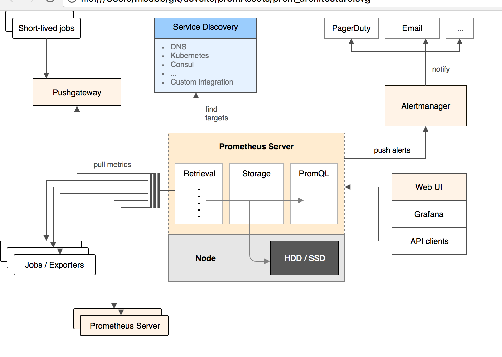

### Prometheus

- inspired by Google's Borgmon (cousin to Kubernetes)
- Cloud Native Computing Foundation
- numerical timeseries based monitoring system

+++
The name comes from Greek mythology, Prometheus was a Titan who took fire from the gods and gave it to humans.

+++
### Components

UNIX ethos
  - 'DOTADIW'
  - ecosystem - work well with other tools

---

#### Prometheus
- core service
- pull metrics from assets
  - application code
  - exporter
  - from push gateway

---

#### AlertManager
- clearing house for alerts

---

#### Exporters

+++

##### Prometheus Exporters
Databases
Hardware
Messaging systems
Storage
APIs, Logging, Miscellaneous...

---
Exporters

---

##### Prometheus Exporters in use

  - Node/system metrics exporter __(official)__
  - Memcached exporter __(official)__
  - MySQL server exporter __(official)__
  - HAProxy exporter __(official)__
  - Blackbox exporter __(official)__
  - cAdvisor
  - redis
  - Forensiq Pixel (custom)

+++

### Links and contact

list of exporters
- https://prometheus.io/docs/instrumenting/exporters/

guidelines on writing exporters
- https://prometheus.io/docs/instrumenting/writing_exporters/

Michael Bubb
- slack \@mbubb
